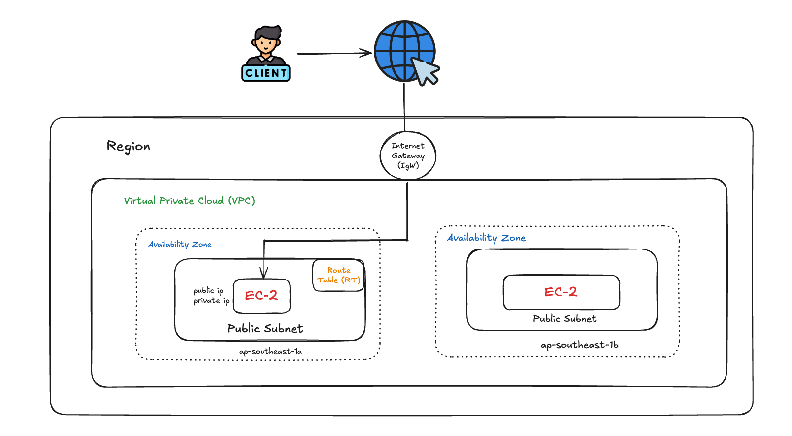
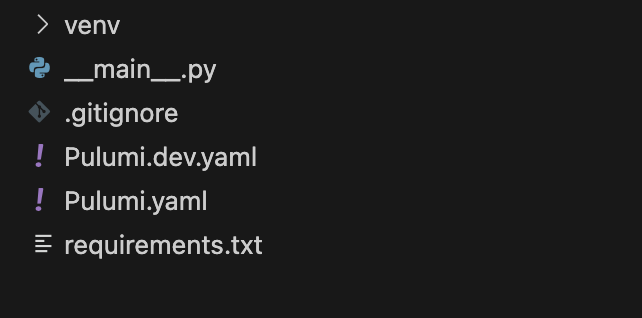

# AWS Deployment Using Pulumi

This guide provides step-by-step instructions for deploying a simple AWS infrastructure using Pulumi as **Infrastructure as Code (IaC)**.



---

## Prerequisites

Before starting, ensure you have the following:

1. **AWS Account** or IAM permissions with necessary access.
2. **AWS CLI** ([Installation Guide](https://docs.aws.amazon.com/cli/latest/userguide/getting-started-install.html)).
3. **Pulumi CLI** ([Installation Guide](https://www.pulumi.com/docs/get-started/install/)).
4. Python environment with a package manager like `pip` or `poetry`.

---

## Step-by-Step Guide

### 1. Configure AWS CLI

1. Open a terminal and type:
    ```bash
    aws configure
    ```
2. Enter your AWS **Access Key**, **Secret Key**, and **Default Region** when prompted.
   - These credentials are sensitive. Ensure they are disabled or deleted after the proof of concept (POC).

---

### 2. Configure Pulumi

1. Initialize a new Pulumi project by typing:
    ```bash
    pulumi new aws-python
    ```
2. This command creates the necessary folder structure for a Python project.
3. Activate the virtual environment:
    ```bash
    source venv/bin/activate
    ```
4. The project structure will look like this:

    

---

### 3. AWS Infrastructure Deployment

Pulumi will help create and deploy the following resources:

1. **Virtual Private Cloud (VPC):** A private network for your infrastructure.
2. **Public Subnet:** Hosts EC2 instances with internet access.
3. **Internet Gateway (IGW):** Enables internet connectivity for the VPC.
4. **Route Table:** Routes internet traffic via the IGW.
5. **Security Group:** Manages traffic rules:
   - **ICMP:** Allows ping requests.
   - **SSH (Port 22):** Enables remote access.
   - **HTTP (Port 80):** Opens the NGINX web server.
6. **User Data Script:** Installs and configures NGINX on EC2 instances.

---

### 4. EC2 Configuration Script

Here’s a sample **user_data** script for NGINX installation:

```bash
#!/bin/bash
sudo apt update
sudo apt install -y nginx
sudo systemctl enable nginx
sudo systemctl start nginx
echo "<h1>Welcome to Pulumi Nginx Server</h1>" | sudo tee /var/www/html/index.html
```

---

### 5. Deployment Steps

1. Deploy the infrastructure using Pulumi:
    ```bash
    pulumi up
    ```
2. Confirm the resources have been created in the AWS Management Console:
    - Look for an EC2 instance named `my-ec2-instance`.
    - Note its **Public IP Address**.

---

## Verifying the Deployment

1. Open your browser and visit:
    ```plaintext
    http://<your_public_ip>:80
    ```
2. You should see:
    ```html
    Welcome to Pulumi Nginx Server
    ```

---

## Conclusion

Your AWS infrastructure is now deployed with a fully functional EC2 instance running NGINX. You can scale this setup further by adding SSL, load balancers, or path-based routing as needed.

